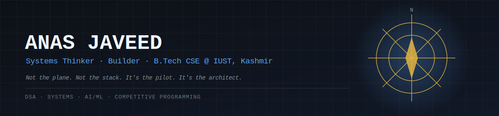

<div align="center">




</div>

<br/>

### ✈️ The Flight Log

> A plane doesn't decide where it goes — the pilot does. Anyone can pick up a framework; what actually matters is the person deciding what to build and why. So instead of a highlight reel, here's the logbook.

```

$ cat flight_log.txt

[2026]     ENROLLED     — B.Tech CSE, IUST, Kashmir
[2026]     TRAINING     — DSA, CS core, systems thinking
[2026]     GROUND CREW  — Competitive Programming (Codeforces / LeetCode)
[ONGOING]  BUILDS       — real projects, logged the moment they exist
[2030+]    CRUISING ALT — TBD, updated as it happens

```

No placeholder repos pretending to be projects. If it's not below, it doesn't exist yet — and that's on purpose.

<br/>
### 🧠 `whoami`

```python
class Anas:
    def __init__(self):
        self.base       = "Kashmir, India"
        self.studying   = "B.Tech CSE @ IUST"
        self.focus      = ["Systems", "AI/ML", "Competitive Programming"]
        self.philosophy = "It's not the plane. It's the pilot."

    def status(self):
        return "logging hours, not chasing highlights"


anas = Anas()
print(anas.status())
# >> logging hours, not chasing highlights
```


<br/>

### 📖 Ground Reading

Not just training the coding — training the thinking underneath it.

| Book | Author |
|---|---|
| 📕 *Meditations* | Marcus Aurelius |
| 📗 *The 48 Laws of Power* | Robert Greene |
| 📘 *Can't Hurt Me* | David Goggins |
| 📙 *The Laws of Human Nature* | Robert Greene |

<br/>

### 🧭 Currently

- [x] Laying CS foundations before touching frameworks — DSA, systems, real understanding over shortcuts
- [ ] Ramping up competitive programming once coursework picks up
- [ ] First real project logged in the flight log above

<br/>

### 🏗️ The Blueprint

> A stack is just materials — steel, glass, whatever's on hand. It's the architect who decides what gets built, and why it holds up. Here's what's currently on the drafting table, labeled honestly: in progress, not mastered.


<br/>

### 📊 Instrument Panel

<p align="center">
  
  
</p>
<p align="center">
  
</p>

<br/>

### 📡 Transmit

<p align="center">
<a href=https://linkedin.com/in/Anas javeed></a>
<a href=https://x.com/TheAnasjaveed></a>
</p>

<div align="center">
<sub><i>"The obstacle is the way." — building through it, not around it.</i></sub>
</div>
